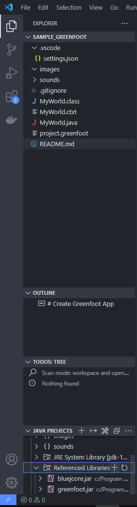
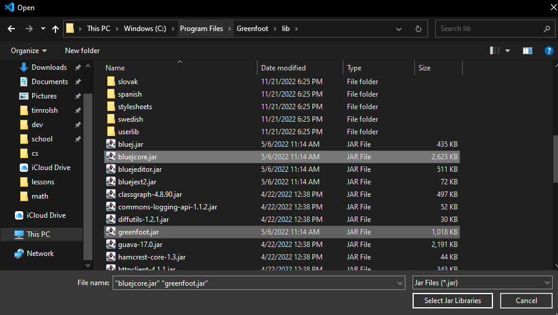

# Create Greenfoot App

-   Empty Greenfoot projects that it makes you when you first create a project
-   Method to make Greenfoot work with vscode as well
-   If you're on Windows, same path as I have set up in settings.json should work
-   to manually set up the path, in vscode go to java projects --> Referenced Libraries --> and add /lib/bluejcore.jar and /lib/greenfoot.jar, from the folder where Greenfoot is installed. This will remove all errors and make vscode code completion work with Greenfoot
    
    
